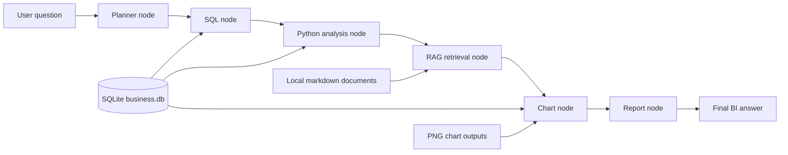
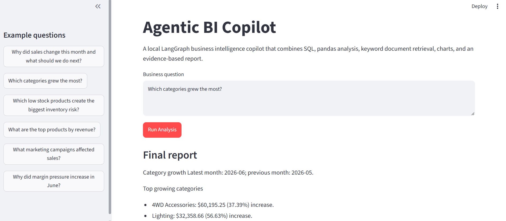
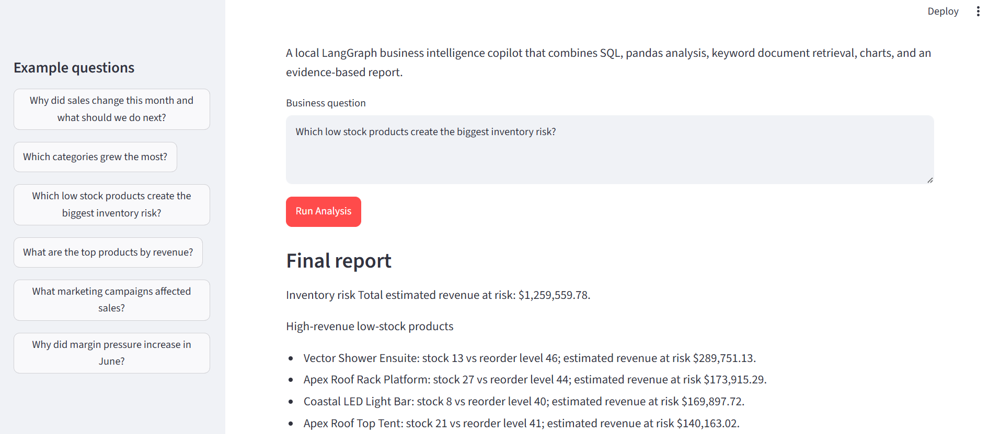
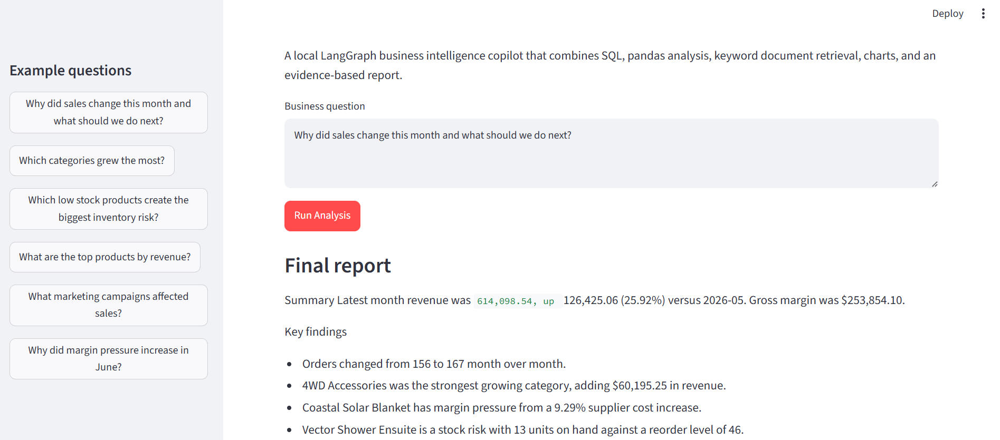

# Agentic BI Copilot

Agentic BI Copilot is a local prototype for answering business questions from a small sample company dataset. It combines SQL queries, pandas analysis, keyword document retrieval, chart generation, and a Streamlit interface into one inspectable BI workflow.

The project uses generated/sample business data. It is not connected to production systems, does not require an OpenAI key, and currently runs as a local application.

## What It Does

The app takes a business question, routes it to a known analysis path, gathers structured data from SQLite, calculates metrics in Python, retrieves supporting notes from local markdown documents, creates charts, and returns a short evidence-based report.

Supported question types include:

- Category growth
- Inventory risk
- Margin pressure
- Top products
- Monthly sales summaries
- General business performance reviews

## Business Problem

Business teams often need answers that are split across databases and documents. Revenue, margin, inventory, and returns usually live in structured systems, while the context behind those numbers may be in notes, policies, supplier updates, or promotion calendars.

This project shows how those sources can be combined in a simple local workflow so a user can ask one question and get the numbers, context, charts, and supporting evidence in one place.

## Why This Project Matters

Many analytics tools answer only from tables or only from documents. Real business questions usually need both.

This project combines SQL, Python analysis, document retrieval, charts, and evidence-based reporting in a way that is easy to inspect and test. Each step is explicit: the route, SQL result, analysis output, retrieved document context, chart artifact, and final answer can all be reviewed.

## Key Features

- LangGraph workflow with planner, SQL, analysis, RAG, chart, and report nodes.
- Read-only SQLite database with orders, products, inventory, suppliers, returns, and marketing spend.
- Safe SQL tool for `SELECT` queries and fixed business query tasks.
- pandas analysis for sales trends, category movement, margin pressure, and inventory risk.
- Keyword retrieval over local markdown business documents.
- matplotlib chart generation into `outputs/charts/`.
- Streamlit UI for entering questions, viewing reports, inspecting routing, and reviewing evidence.
- Evaluation framework with 15 regression questions.
- Docker setup for running the local Streamlit app.

## Architecture



The graph implementation is in `agents/graph.py`. The graph state carries the original question, routing decision, SQL results, analysis output, retrieved document snippets, chart metadata, and final answer.

## Tech Stack

- Python
- LangGraph
- SQLite
- pandas
- matplotlib
- Streamlit
- Docker and Docker Compose
- JSON and Markdown evaluation outputs

## Data

The local database is generated at `data/processed/business.db`. It represents a small retail and distribution business with sample data for:

- Customers
- Suppliers
- Products and categories
- Orders and order items
- Inventory and reorder levels
- Supplier price changes
- Returns
- Marketing spend

Supporting markdown documents live in `data/documents/` and include KPI definitions, manager notes, inventory rules, shipping policy, promotion calendar, and supplier price updates.

## Run Locally

Create and activate a virtual environment:

```powershell
python -m venv .venv
.\.venv\Scripts\Activate.ps1
```

Install dependencies:

```powershell
pip install -r requirements.txt
```

Create or refresh the sample database:

```powershell
python scripts/create_sample_db.py
```

Run the Streamlit app:

```powershell
streamlit run app/streamlit_app.py
```

Open the app at:

```text
http://localhost:8501
```

## Run With Docker

Build and start the app:

```powershell
docker compose up --build
```

Open:

```text
http://localhost:8501
```

Stop the container:

```powershell
docker compose down
```

Docker creates the runtime folders and generates `data/processed/business.db` at startup if the database is missing. More setup notes are in `docs/docker_setup.md`.

## Run Evaluations

Run the full evaluation suite:

```powershell
python scripts/run_evals.py
```

Run the routing smoke test:

```powershell
python scripts/test_question_routing.py
```

Run the graph smoke test:

```powershell
python agents/graph.py
```

Evaluation outputs are written to:

- `outputs/evals/evaluation_results.json`
- `outputs/evals/evaluation_summary.md`

## Example Questions

- Which categories grew the most?
- Which low stock products create the biggest inventory risk?
- Why did margin pressure increase in June?
- What are the top products by revenue?
- Why did sales change this month and what should we do next?
- Give me an overall business performance review.

## Screenshots

Category growth analysis



Inventory risk analysis



Monthly business summary



## Evaluation Result

Current evaluation status:

- Total tests: 15
- Passed tests: 15
- Failed tests: 0
- Pass rate: 100.00%

The tests cover routing and expected answer content for category growth, inventory risk, margin pressure, top products, monthly summaries, and general business reviews.

## Assets

The `assets/` folder is reserved for project screenshots and demo images. No screenshots are currently included. See `assets/README_PLACEHOLDER.md` for suggested screenshot names if UI captures are added later.

## Documentation

- `docs/project_summary.md` explains the project in plain English.
- `docs/evaluation_report.md` summarizes the QA approach and current 15/15 result.
- `docs/technical_architecture.md` documents modules, graph state, node flow, and data flow.
- `docs/docker_setup.md` explains the Docker workflow.
- `docs/architecture.md` contains earlier architecture notes.

## Limitations

- Uses generated/sample business data, not live production data.
- RAG currently uses keyword matching, not embeddings.
- Router is rule-based, not LLM-based.
- Reports are deterministic templates, which keeps results inspectable but limits natural-language flexibility.
- No authentication or user management.
- Not deployed to cloud yet.
- Evaluation checks routing and expected answer content, but does not fully verify every numeric calculation.

## Roadmap

- Add embedding-based document retrieval with source citations.
- Add numeric assertions and chart artifact checks to the evaluation suite.
- Add a review node that checks whether the final report is fully supported by evidence.
- Expand the sample data with more edge cases and business scenarios.
- Improve the Streamlit UI with saved questions, filters, and downloadable reports.
- Add authentication, user management, and a cloud deployment path.
