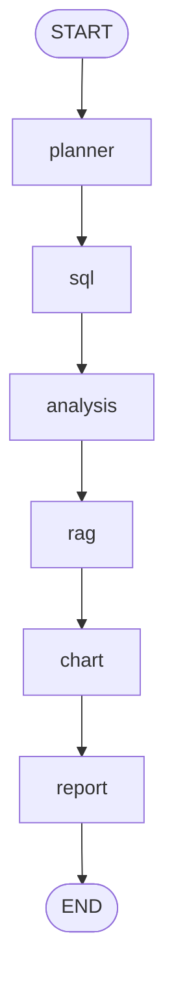

# Technical Architecture

## Folder Structure

```text
agents/      LangGraph orchestration and graph state
app/         Streamlit UI and app entry points
assets/      Placeholder for future screenshots and demo images
data/        Local business database and markdown documents
docs/        Project, evaluation, and architecture documentation
evals/       Evaluation question set
notebooks/   Reserved for exploratory analysis
outputs/     Generated charts and evaluation outputs
scripts/     Setup, smoke test, and evaluation scripts
tests/       Reserved for future automated tests
tools/       SQL, analysis, RAG, and chart helper modules
```

## Main Modules

- `agents/graph.py`: Defines `AgentState`, graph nodes, routing logic, report formatting, graph construction, and `run_agent`.
- `tools/sql_tool.py`: Provides read-only SQLite execution and canned SQL analysis functions.
- `tools/analysis_tool.py`: Calculates monthly performance, category movement, margin pressure, inventory risk, and recommendations.
- `tools/rag_tool.py`: Loads markdown documents, chunks text, scores keyword matches, and returns relevant snippets.
- `tools/chart_tool.py`: Generates standard chart PNG files and returns chart metadata.
- `app/streamlit_app.py`: Runs the local UI for asking questions and reviewing outputs.
- `scripts/run_evals.py`: Runs the evaluation suite and writes JSON and Markdown results.

## LangGraph Node Flow



## State Fields

`AgentState` currently includes:

- `question`: Original user question.
- `plan`: Human-readable plan generated by the planner node.
- `sql_task`: Selected SQL task, such as `monthly_sales_summary`.
- `answer_type`: Selected answer type, such as `inventory_risk`.
- `focus_area`: Business focus phrase used by reports and evaluations.
- `sql_result`: Rows returned by the selected SQL query.
- `analysis_result`: Python-generated business metrics and recommendations.
- `rag_context`: Retrieved document snippets with source filenames and scores.
- `chart_outputs`: Generated chart metadata.
- `answer`: Final report text.

## Tool Responsibilities

### SQL Tool

The SQL tool owns database access. It keeps execution read-only and exposes specific business query helpers for top products, monthly sales, and low-stock high-revenue products.

### Python Analysis Tool

The analysis tool owns metric calculations that are easier to maintain in pandas than in SQL templates. It produces reusable evidence for all report types.

### RAG Tool

The retrieval tool owns local document loading, chunking, keyword scoring, and source tracking. It returns snippets that can support the final report.

### Chart Tool

The chart tool owns visual output generation. It creates monthly revenue, category revenue change, and inventory risk charts in `outputs/charts/`.

### Report Logic

The report logic in `agents/graph.py` selects the right deterministic formatter for the answer type. This keeps reports predictable and makes evaluation easier.

## Data Flow

1. User input enters `run_agent(question)`.
2. The planner writes `sql_task`, `answer_type`, and `focus_area`.
3. The SQL node writes `sql_result`.
4. The analysis node writes `analysis_result`.
5. The RAG node writes `rag_context`.
6. The chart node writes `chart_outputs`.
7. The report node writes `answer`.
8. The Streamlit UI and evaluation runner read the resulting state.

This structure keeps the business answer traceable from question to final report.
